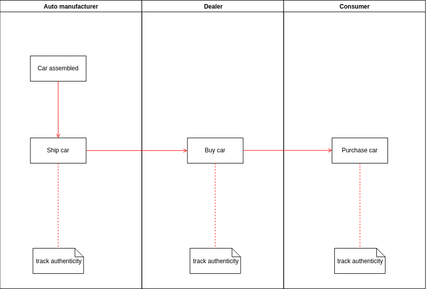
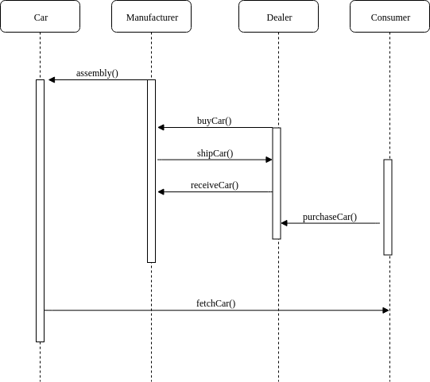
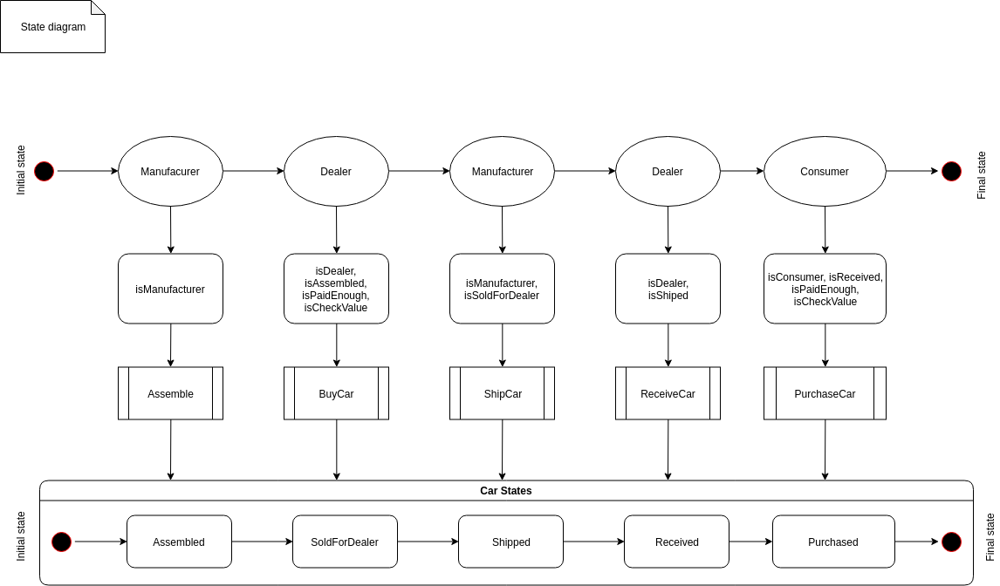
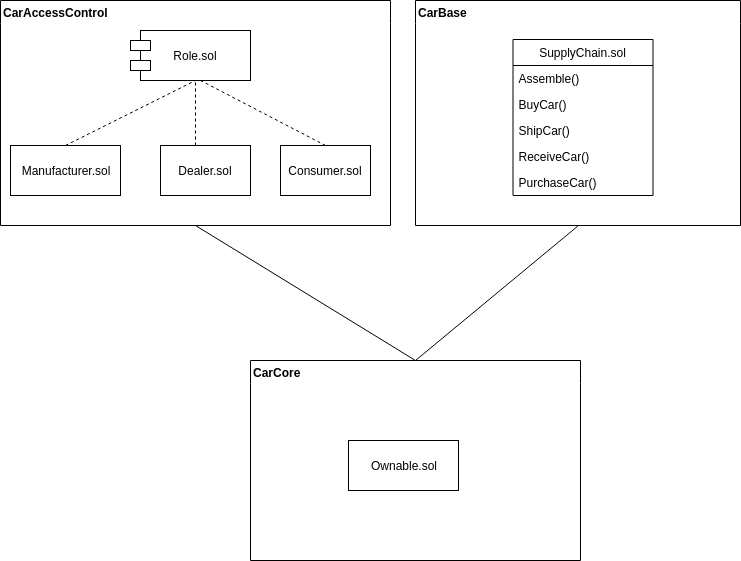

# Supply chain & data auditing

This repository containts an Ethereum DApp that demonstrates a Supply Chain flow between a Seller and Buyer. The user story is similar to any commonly used supply chain process. A Seller can add items to the inventory system stored in the blockchain. A Buyer can purchase such items from the inventory system. Additionally a Seller can mark an item as Shipped, and similarly a Buyer can mark an item as Received.

The list of UML diagrams:

Activity diagram


Sequence diagram


State diagram


Data model diagram



## Getting Started

These instructions will get you a copy of the project up and running on your local machine for development and testing purposes. See deployment for notes on how to deploy the project on a live system.

### Prerequisites

Please make sure you've already installed ganache-cli, Truffle and enabled MetaMask extension in your browser.

```
node v10.15.2

Ganache CLI v6.3.0 (ganache-core: 2.4.0)

Truffle v4.1.14 (core: 4.1.14)
Solidity v0.4.24 (solc-js)

```

### Installing

A step by step series of examples that tell you have to get a development env running

Clone this repository:

```
git clone https://github.com/n-nik/p6-supply-chain.git
```

Change directory to ```project-6``` folder and install all requisite npm packages (as listed in ```package.json```):

```
cd project-6
npm install
```

Launch Ganache:

```
ganache-cli -m "spirit supply whale amount human item harsh scare congress discover talent hamster"
```

In a separate terminal window, Compile smart contracts:

```
truffle compile
```

This will create the smart contract artifacts in folder ```build\contracts```.

Migrate smart contracts to the locally running blockchain, ganache-cli:

```
truffle migrate
```

Test smart contracts:

```
truffle test
```

All 6 tests should pass.

In a separate terminal window, launch the DApp:

```
npm run dev
```

## Deploy to Rinkeby test network information
```
truffle migrate --reset --network rinkeby

Using network 'rinkeby'.

Running migration: 1_initial_migration.js
  Deploying Migrations...
  ... 0x745f5ac05236ffcff53584c6ddb51bbc6e8421d747bb3cebc6ce6844d2f3ef43
  Migrations: 0xe6f44b592ee08a1483898b33f582e54aca55b33b
Saving successful migration to network...
  ... 0x5d87c00bf836c0f5c44162ccd66e0bad1cc0189ea30956d9a5201944e226ffe5
Saving artifacts...
Running migration: 2_deploy_contracts.js
  Deploying ManufacturerRole...
  ... 0xb71c5bf38adaf6a9fa1316af8236af38905130d068aa479561f404847f74dccc
  ManufacturerRole: 0xebef5df4d9f577c019b02ee51684627c6c9131c7
  Deploying DealerRole...
  ... 0x5a7319e766bcdf0ff64c98537add21a8c68fd956fbb2abab1e3607eb8313d273
  DealerRole: 0xab871bc64e34a2a6984eb27c583e1475f8c9116e
  Deploying ConsumerRole...
  ... 0xac5bd0814ebbb7e82065feb3772ba2a8110ff6b3369f3723109a457f1e228f00
  ConsumerRole: 0x3d580e5901910ba022ea7234412eec912a93b373
  Deploying SupplyChain...
  ... 0x2d595bee1fcdf8efd39f44947be7ae91430e92430cb55976c1ef46ca1316fad4
  SupplyChain: 0xa15f8a43503a8df9b378d3365f1a59d49fdc950a
Saving successful migration to network...
  ... 0xb4e18ce0c541336ca52407577c66ebf2532464af9d693ef15962266fb2032064
Saving artifacts...

```
## Built With

* [Ethereum](https://www.ethereum.org/) - Ethereum is a decentralized platform that runs smart contracts
* [Truffle Framework](http://truffleframework.com/) - Truffle is the most popular development framework for Ethereum with a mission to make your life a whole lot easier.

## Acknowledgments

* Solidity
* Ganache-cli
* Truffle
